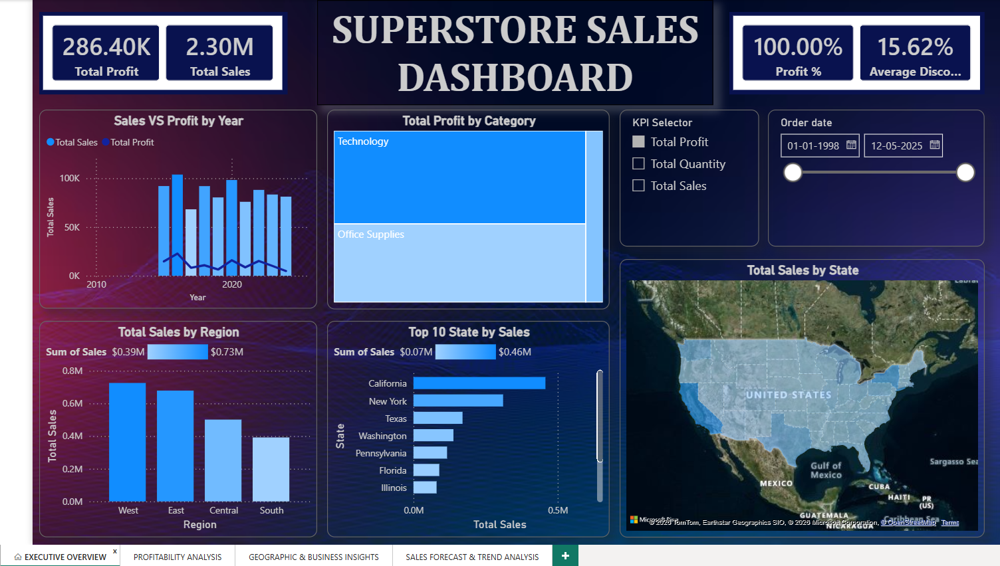
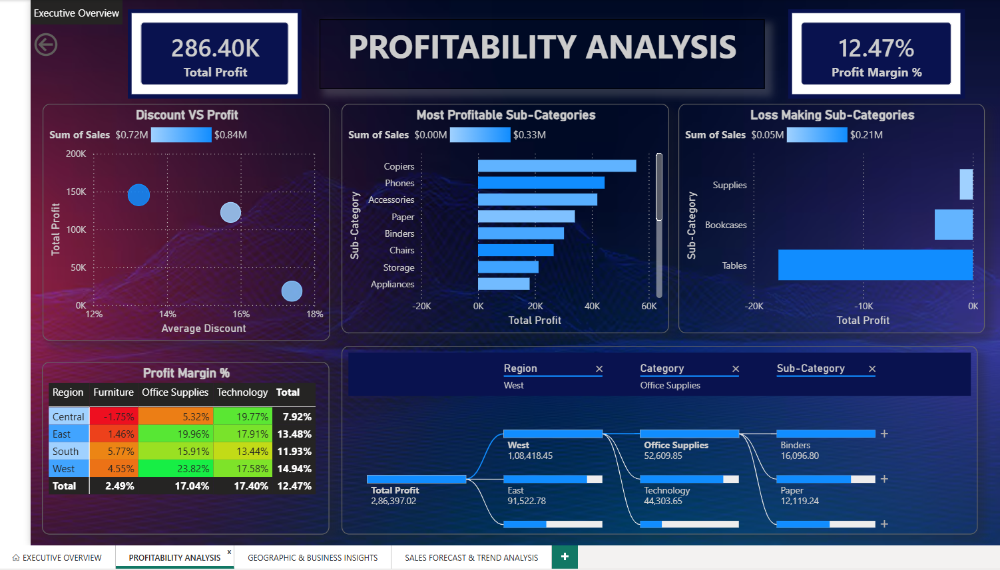
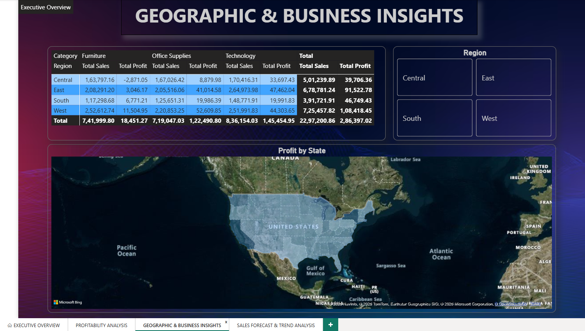
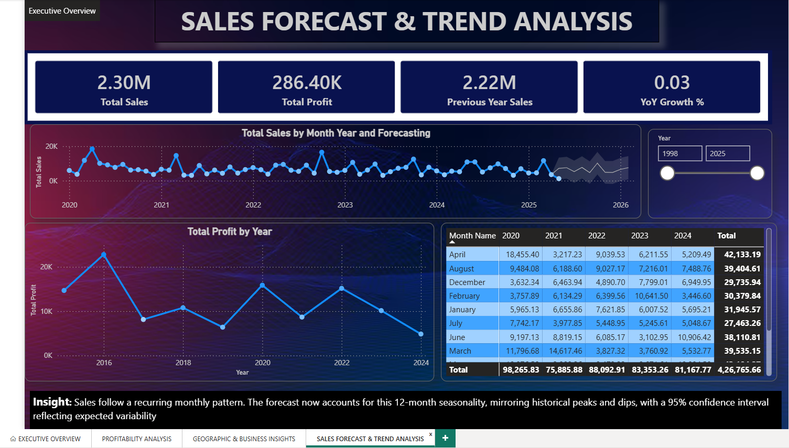

**Superstore Sales Analysis & Forecasting Dashboard**

An end-to-end **Business Intelligence** project developed using **Microsoft Power BI** to analyze Superstore sales performance, profitability, regional trends, and forecast future sales. The dashboard provides interactive insights that help stakeholders monitor KPIs, identify growth opportunities, and support data-driven business decisions.

**Project Overview**

This project transforms raw Superstore sales data into an interactive Power BI dashboard consisting of four analytical pages:

-  Executive Overview
-  Profitability Analysis
-  Geographic & Business Insights
-  Sales Forecast & Trend Analysis

The report enables users to explore sales performance through dynamic filters, KPIs, maps, trend analysis, and forecasting.

**Key Features**

 Executive Overview
- Total Sales & Total Profit KPIs
- Profit Percentage & Average Discount
- Sales vs Profit Trend by Year
- Profit by Category
- Sales by Region
- Top 10 States by Sales
- Sales Distribution Map
- Interactive KPI Selector
- Dynamic Date Filter

 Profitability Analysis
- Profit Margin KPI
- Discount vs Profit Analysis
- Most Profitable Sub-Categories
- Loss-Making Sub-Categories
- Profit Margin Matrix
- Decomposition Tree Analysis
- Region, Category & Sub-Category Filters

 Geographic & Business Insights
- Regional Sales & Profit Summary
- Category-wise Performance
- Interactive State Map
- Regional Business Comparison

 Sales Forecast & Trend Analysis
- Monthly Sales Trend
- 12-Month Sales Forecast
- Year-over-Year Growth
- Previous Year Sales Comparison
- Profit Trend Analysis
- Monthly Performance Matrix
- Dynamic Year Filter

 **Tools & Technologies**

- Microsoft Power BI
- Power Query
- DAX
- Data Modeling
- CSV Dataset
- Power BI Forecasting
- Git & GitHub

** KPIs**

- Total Sales
- Total Profit
- Profit Margin %
- Average Discount %
- Previous Year Sales
- Year-over-Year Growth
- Sales Forecast

 **Skills Demonstrated**

- Data Cleaning & Transformation
- Data Modeling
- DAX Measures
- Time Intelligence
- KPI Development
- Interactive Dashboard Design
- Data Visualization
- Business Intelligence Reporting
- Forecasting & Trend Analysis
- Geographic Analysis

📂 Project Files

- Power BI Project (.pbip)
- Report & Semantic Model
- Sample Dataset
- Dashboard Screenshots
- PDF Report

  **Dashboard Preview**

### Executive Overview

### Profitability Analysis

### Geographic & Business Insights

### Sales Forecast & Trend Analysis

 📈 Business Insights

- The **West** region generated the highest sales among all regions.
- **Technology** is the highest profit-generating category.
- Certain sub-categories operate at a loss despite generating sales.
- Higher discounts generally reduce overall profitability.
- Sales exhibit recurring seasonal patterns that support reliable forecasting.
- Interactive filters enable detailed analysis by date, region, category, and sub-category.

Getting Started

1. Clone this repository.
2. Open the `.pbip` project in Microsoft Power BI Desktop.
3. Refresh the dataset if prompted.
4. Explore the interactive dashboard.

Author

**Fathimath Farha**

Aspiring Data Analyst | Power BI Developer

⭐ If you like this project, consider giving it a Star!
